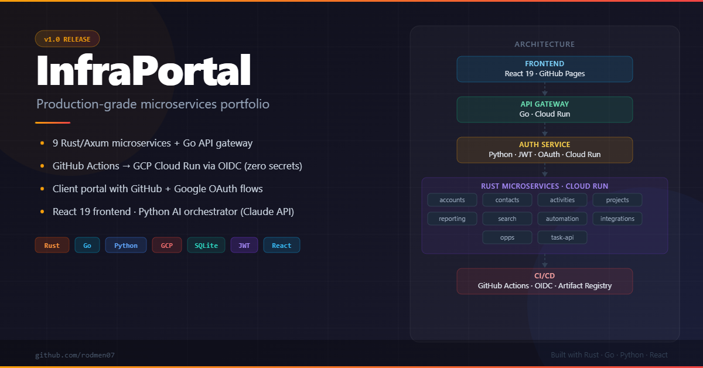

# Portfolio

Production-grade cloud engineering projects demonstrating Rust, Python, TypeScript, Go, and Terraform across AWS and GCP.

**Live site:** https://rodmen07.github.io/infraportal/

---

## Projects

### 1. [InfraPortal — Microservices Platform](./microservices/)

9-service CRM platform with SQLite persistence, JWT authentication, and AI integration. All 11 backend services deployed on GCP Cloud Run (scale-to-zero, us-central1) with GitHub Actions OIDC CI/CD. Includes a client portal with GitHub + Google OAuth and an admin provisioning UI.

#### Services

| Service | Language | Deployment | Role |
|---------|----------|-----------|------|
| `task-api-service` | Rust / Axum | Fly.io | Core task CRUD, AI planner proxy, audit log |
| `accounts-service` | Rust / Axum | GCP Cloud Run | Account and tenant domain |
| `contacts-service` | Rust / Axum | GCP Cloud Run | Contact and lead domain, cross-service account validation |
| `activities-service` | Rust / Axum | GCP Cloud Run | Activity tracking |
| `automation-service` | Rust / Axum | GCP Cloud Run | Automation rules |
| `integrations-service` | Rust / Axum | GCP Cloud Run | Third-party integration hooks |
| `opportunities-service` | Rust / Axum | GCP Cloud Run | Sales opportunity domain |
| `reporting-service` | Rust / Axum | GCP Cloud Run | Aggregated reports |
| `search-service` | Rust / Axum | GCP Cloud Run | Cross-domain search |
| `projects-service` | Rust / Axum | GCP Cloud Run | Client portal data — projects, milestones, deliverables |
| `ai-orchestrator-service` | Python / FastAPI | Fly.io | LLM-backed goal-to-task planner (Claude API) |
| `auth-service` | Python / FastAPI | GCP Cloud Run | JWT issuance, GitHub + Google OAuth |
| `event-stream-service` | Go | Fly.io | SSE hub — real-time event fan-out with ring buffer replay |
| `go-gateway` | Go | GCP Cloud Run | API gateway — rate limiting, reverse proxy to all microservices |
| `frontend-service` | React 19 / Vite / TypeScript | GitHub Pages | Portfolio site, admin dashboard, client portal |

#### Architecture

```
  React/Vite UI (GitHub Pages)
        │
   Go API Gateway (rate limiting, reverse proxy)
        │
  Rust/Axum task-api  ──  Python AI Orchestrator (Claude API)
        │
  Domain microservices (Rust/Axum, PostgreSQL/SQLite)
  accounts · contacts · activities · automation
  integrations · opportunities · reporting · search

  Client Portal
  Rust projects-service (projects · milestones · deliverables · messages)
```

#### Key features

- AI goal planner — describe a goal, generate structured sub-tasks via LLM
- JWT auth with cross-service token validation (role-based: user / planner / admin)
- Admin dashboard — request audit logs, per-user activity, aggregated CRM metrics
- Full CI/CD via GitHub Actions — per-service Docker builds, automated deploys to Cloud Run
- Terraform IaC for GCP baseline: Cloud Run, Cloud SQL, Artifact Registry, Secret Manager

#### Tech

Rust Axum 0.8 · sqlx 0.8 · PostgreSQL · Python FastAPI · Go · Anthropic Claude API · React 19 · Vite · Tailwind CSS v3 · TypeScript · Terraform · GitHub Actions · Docker · OIDC (Workload Identity Federation)

---

### 1a. [SOC 2 Baseline — Terraform Module](./microservices/terraform-soc2-baseline/)

Cloud-agnostic GCP + AWS Terraform module implementing 9 SOC 2 Type II controls as reusable infrastructure code. Extracted from InfraPortal's security hardening and designed to be forked.

#### Controls implemented

| Control | GCP | AWS |
|---------|-----|-----|
| CC6.1 — Logical access | Per-service service accounts, no owner/editor roles | Per-service IAM roles, resource-scoped ARNs |
| CC6.2 — Authentication | Workload Identity Federation (OIDC), no SA key files | OIDC role assumption only |
| CC6.3 — Privileged access | Minimum required roles only | Inline policies, no wildcard actions |
| CC6.7 — Secrets management | Secret Manager, SA-bound IAM | Secrets Manager, KMS CMK encryption |
| CC7.2 — System monitoring | Cloud Audit Logs + GCS sink | CloudTrail multi-region + S3 |
| CC7.3 — Incident detection | Cloud Logging alert skeleton | CloudWatch root login alarm |
| CC8.1 — Change management | `prevent_destroy` on secrets | S3 versioning + DynamoDB state lock |
| CC6.8 — Non-root containers | USER directive requirement documented | ECS task def `user: "65534"` |
| A1.2 — Availability | Cloud Run `min_instances`, Cloud SQL backups | Multi-AZ subnets, ECS `desired_count ≥ 1` |

**Tech:** Terraform · GCP · AWS · Secret Manager · Secrets Manager · KMS · CloudTrail · VPC · IAM · OIDC

---

### 1b. [CI/CD Pipeline Template](./microservices/.github/workflows/deploy-pipeline.yml)

Cloud-agnostic GitHub Actions reference architecture for multi-environment deployments. Extends InfraPortal's existing CI/CD with full promotion gates and automated rollback on both GCP and AWS.

#### Promotion flow

```
test  →  deploy-staging (auto, OIDC)  →  ⏸ approval  →  deploy-prod (OIDC)
          ↓ health-check /health                         ↓ health-check /health
          ↓ rollback on failure                          ↓ rollback on failure
```

- **Environment-scoped OIDC** — staging and production each hold isolated credential sets; GitHub injects the correct set automatically
- **Manual approval gate** — production environment requires reviewer approval before deploy job runs
- **Automated rollback** — GCP via `gcloud run services update-traffic --to-revisions PREVIOUS=100`; AWS via `aws ecs update-service --task-definition <previous-ARN>`
- **Dockerfile lint** — blocks deploy if any service image is missing a `USER` directive (CC6.8)

**Tech:** GitHub Actions · GCP Cloud Run · AWS ECS / Fargate · OIDC · Rust · Python · Docker · Bash

---

### 3. [Observaboard — Django REST API](./observaboard/)

Webhook event ingestion and classification API demonstrating Django REST Framework, Celery async workers, PostgreSQL full-text search, and dual authentication (JWT + API key).

#### Architecture

```
External source  →  POST /api/ingest/  (API key auth)
                         │
                   Celery worker  →  classify(event)  →  FTS index update
                         │
               GET /api/events/search/?q=  (JWT auth)
               Django Admin  →  browse / manage events
```

#### Key features

- Webhook ingestion with API key authentication
- Celery async classification — assigns category (deployment / security / alert / metric / info) and severity (low / medium / high / critical) from raw payload
- PostgreSQL `SearchVectorField` + `GinIndex` — full-text search over event summaries
- Django Admin — browse, filter, and manage ingested events
- Dual auth — JWT (`djangorestframework-simplejwt`) for API consumers, API key for ingest sources

#### Tech

Django 5 · Django REST Framework · Celery · Redis · PostgreSQL · `djangorestframework-simplejwt` · Docker · Fly.io

---

### 2. [DynamoDB Medallion Pipeline Prototype](./dynamodb_prototype/)

Rust + Go prototype demonstrating exactly-once cloud audit log delivery via DynamoDB conditional writes, with a live inspection dashboard and Go pipeline monitor deployed on Fly.io.

#### Pipeline

```
Raw event (CloudTrail / GCP Cloud Logging / arbitrary JSON)
      │
   Bronze  →  stage#bronze#<uuid>      raw payload, immutable
      │
   Silver  →  stage#silver#<uuid>      normalised, typed, PII-safe
      │
    Gold   →  stage#gold#<uuid>        aggregated metrics, downstream-ready
      │
   Sink    →  Splunk HEC / analytics   configurable, skipped gracefully if absent
```

#### Components

| Binary / Service | Language | Role |
|-----------------|----------|------|
| `ingest` | Rust | Write raw event as Bronze record |
| `process_bronze` | Rust | Promote Bronze → Silver |
| `process_silver` | Rust | Promote Silver → Gold |
| `dashboard` | Rust / Axum | HTTP server — DynamoDB inspection APIs + admin UI |
| `go-pipeline-monitor` | Go | Pipeline stage counts + upstream service health checks |

#### Key features

- **Idempotent writes** — `begins_with(sk, "stage#<tier>#")` scan + conditional PutItem prevents duplicate processing
- **`/promote` endpoint** — advance any record Bronze → Silver → Gold via REST (`POST /promote`)
- **Go pipeline monitor** — parallel DynamoDB scans with paginated `Scan`, structured JSON error responses, CORS origin allowlist
- **Pluggable sink** — Splunk HEC with configurable timeout and retry
- **Security-hardened** — pipeline endpoints gated behind `require_admin`; OIDC CI migration; dev bypass removed
- **Contact form inbox** — portfolio contact form POSTs to `/api/contact`; messages stored in DynamoDB and readable in the admin dashboard (no third-party email service)

#### Tech

Rust async (Tokio) · `aws-sdk-dynamodb` · Axum 0.8 · Go 1.22 · AWS SDK for Go v2 · Single-table DynamoDB design · Docker · Fly.io · AWS SAM / CloudFormation

---

### 4. [Vertex AI Second Brain Prototype](./vertexai-secondbrain/)

FastAPI prototype for a document-grounded AI assistant pattern intended to demonstrate the GCP / Vertex AI consulting shape: document ingestion, source attribution, external connectors, and later Agent Builder integration.

#### Current implementation

- PDF and plain-text ingestion with citation-shaped responses
- Minimal agent scaffold with `init` and `query` endpoints
- Initial Google Drive connector module for listing and downloading files
- Local unit tests for ingest, agent scaffold, and Drive connector
- Workspace-level CI runner support and saved test artifacts for multi-repo validation

#### Next steps

- Wire Drive access into the live app flow
- Enable web grounding and Vertex AI-side agent configuration
- Add Firestore-backed session state and external extension support

#### Tech

Python · FastAPI · `pypdf` · Google Drive API client · pytest · GitHub Actions · Docker

---

## Repository layout

```
Portfolio/
├── observaboard/                         # Django REST API (Fly.io)
│   ├── observaboard/                     #   Django project (settings, urls, celery)
│   ├── events/                           #   App: models, views, tasks, serializers
│   ├── requirements.txt
│   ├── Dockerfile
│   └── fly.toml
├── microservices/                        # InfraPortal platform
│   ├── accounts-service/                 # Rust/Axum, PostgreSQL
│   ├── contacts-service/                 #   ↳ cross-service account validation
│   ├── activities-service/               # Rust/Axum, SQLite
│   ├── automation-service/               #   ↳ workflow rules
│   ├── integrations-service/             #   ↳ third-party hooks
│   ├── opportunities-service/            #   ↳ sales pipeline
│   ├── reporting-service/                #   ↳ aggregated reports
│   ├── search-service/                   #   ↳ cross-domain search
├── backend-service/                      # task-api (Rust/Axum, Fly.io)
├── go-gateway/                           # Go API gateway (rate limiting, reverse proxy)
├── projects-service/                     # Client portal data service (Rust/Axum, Fly.io)
├── frontend-service/                     # React 19 UI + client portal (GitHub Pages)
├── auth-service/                         # Python JWT service
├── ai-orchestrator-service/              # Python / Claude API
├── event-stream-service/                 # Go SSE hub (Fly.io)
├── vertexai-secondbrain/                 # FastAPI document-ingest and agent prototype
├── terraform-soc2-baseline/              # Cloud-agnostic SOC 2 module
│   ├── modules/gcp/                      #   GCP sub-module (8 .tf files)
│   └── modules/aws/                      #   AWS sub-module (8 .tf files)
└── docs/cicd-template/                   # CI/CD reference docs
    └── scripts/                          #   health-check, rollback-gcp, rollback-aws
    └── .github/workflows/
        ├── rust.yml                      # Primary CI (test, audit, deploy)
        └── deploy-pipeline.yml           # Reference multi-env promotion template
└── scripts/
    └── run-checks.ps1                    # Full workspace test runner
└── dynamodb_prototype/                   # DynamoDB medallion pipeline
    ├── src/bin/                          # Rust pipeline binaries + dashboard
    ├── go-pipeline-monitor/              # Go service (Fly.io)
    ├── docs/                             # Case study, OIDC setup guide
    └── template.yaml                     # AWS SAM / CloudFormation
```

## Running checks

This workspace now uses two levels of test execution:

- `run_workspace_tests.sh` at the repo root for cross-repo validation in CI and local bash environments
- `microservices/scripts/run-checks.ps1` for deeper microservices-only verification on Windows

### Option 1: run the workspace runner

```bash
cd d:/Projects/Portfolio
bash ./run_workspace_tests.sh
```

### Option 2: run microservices checks from the microservices directory

```powershell
cd d:\Projects\Portfolio\microservices
.\scripts\run-checks.ps1
```

## Submodule workflow

This workspace uses git submodules for each service, where each subproject is an independently-versioned repository:

- `microservices`
- `dynamodb_prototype`
- `ai-orchestrator-service`
- `auth-service`
- `backend-service`
- `event-stream-service`
- `frontend-service`
- `go-gateway`
- `observaboard`
- `projects-service`

### Common commands

- Initialize after clone:
  - `git submodule update --init --recursive`
- Update all submodules to latest configured commits:
  - `git submodule update --remote --recursive`
- Inspect submodule status:
  - `git submodule status --recursive`
- Commit new submodule commit pointer:
  - `cd <submodule>; git pull origin main; cd ..; git add <submodule>; git commit -m "Update <submodule> pointer"`

**Note:** run `git clean -fdx` in submodule directories only if you want a full clean state and are okay losing uncommitted local changes.

### Option 3: run per service or submodule

You can also run `cargo test`, `cargo clippy`, `npm run build`, etc. in each service directory directly.

### Recommended local verification (service-level)

```powershell
cd d:\Projects\Portfolio\microservices\reporting-service
$env:AUTH_JWT_SECRET='dev-insecure-secret-change-me'
cargo test

cd ..\accounts-service
$env:TEST_DATABASE_URL='sqlite::memory:'
$env:AUTH_JWT_SECRET='dev-insecure-secret-change-me'
cargo test

# repeat for contacts-service, opportunities-service, activities-service, etc.
```

---

## Deployment summary

| App | Platform | URL |
|-----|----------|-----|
| frontend-service | GitHub Pages | https://rodmen07.github.io/infraportal/ |
| auth-service | GCP Cloud Run | https://auth-service-5gcrg4oiza-uc.a.run.app |
| go-gateway | GCP Cloud Run | https://go-gateway-5gcrg4oiza-uc.a.run.app |
| projects-service | GCP Cloud Run | https://projects-service-5gcrg4oiza-uc.a.run.app |
| accounts-service | GCP Cloud Run | https://accounts-service-5gcrg4oiza-uc.a.run.app |
| contacts-service | GCP Cloud Run | https://contacts-service-5gcrg4oiza-uc.a.run.app |
| activities-service | GCP Cloud Run | https://activities-service-5gcrg4oiza-uc.a.run.app |
| automation-service | GCP Cloud Run | https://automation-service-5gcrg4oiza-uc.a.run.app |
| integrations-service | GCP Cloud Run | https://integrations-service-5gcrg4oiza-uc.a.run.app |
| opportunities-service | GCP Cloud Run | https://opportunities-service-5gcrg4oiza-uc.a.run.app |
| reporting-service | GCP Cloud Run | https://reporting-service-5gcrg4oiza-uc.a.run.app |
| search-service | GCP Cloud Run | https://search-service-5gcrg4oiza-uc.a.run.app |
| task-api-service | Fly.io | https://backend-service-rodmen07-v2.fly.dev |
| ai-orchestrator | Fly.io | https://ai-orchestrator-service-rodmen07.fly.dev |
| dashboard (Rust) | Fly.io | https://dynamodb-dashboard-rodmen07.fly.dev |
| observaboard | Fly.io | https://observaboard-rodmen07.fly.dev |
| event-stream-service | Fly.io | https://event-stream-service.fly.dev |

---

## Roadmap

### v0.4 — Language Breadth & AI Depth ✅ Complete

| Sub-version | Feature | Status |
|-------------|---------|--------|
| v0.4.1 | AI Consulting Feature | ✅ Published |
| v0.4.2 | Django REST API (`observaboard`) | ✅ Published |
| v0.4.3 | Go Service | ✅ Published |
| v0.4.4 | Frontend UI Expansion — CRM CRUD, Live Feed, Search, Reports, Observaboard pages | ✅ Published |

### v0.5 — Platform Completeness ✅ Complete

| Sub-version | Feature | Status |
|-------------|---------|--------|
| v0.5.1 | reporting-service production upgrade (SQLite, JWT auth, saved report CRUD, /dashboard) | ✅ Published |
| v0.5.2 | search-service production upgrade (cross-domain fan-out search, write-through indexing) | ✅ Published |
| v0.5.3 | activities-service production upgrade (SQLite, JWT auth, CRUD) | ✅ Published |
| v0.5.4 | automation-service production upgrade (SQLite, JWT auth, workflow rules) | ✅ Published |
| v0.5.5 | integrations-service production upgrade (SQLite, JWT auth, connection registry) | ✅ Published |
| v0.5.6 | opportunities-service production upgrade (SQLite, JWT auth, stage tracking) | ✅ Published |

**Completion states:** Planned → Implemented → Published. Published means all release locations updated (see [CLAUDE.md](./microservices/CLAUDE.md) § Release Locations).

### v1.0 — Client Portal ✅ Complete

| Sub-version | Feature | Status |
|-------------|---------|--------|
| v1.0.1 | `projects-service` — Rust/Axum client portal API (projects, milestones, deliverables) | ✅ Published |
| v1.0.2 | `go-gateway` — Go API gateway deployed to GCP Cloud Run | ✅ Published |
| v1.0.3 | GCP Cloud Run migration — 11 services (OIDC + WIF, Artifact Registry, Secret Manager) | ✅ Published |
| v1.0.4 | OAuth flows — GitHub + Google client portal sign-in with client-role JWT | ✅ Published |
| v1.0.5 | Admin provisioning UI — create projects, milestones, deliverables; assign to client users | ✅ Published |

### Backlog

- Cross-service integration features (activities linking to real accounts/contacts)
- Persistent storage for Cloud Run services (Cloud SQL or mounted volumes)
