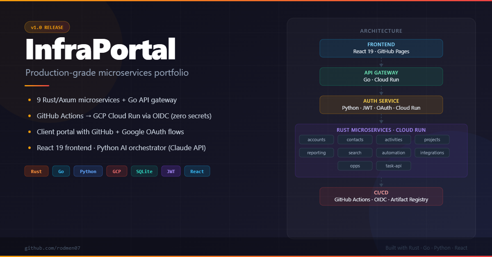

# Portfolio

Production-grade cloud engineering portfolio in Rust, Python, TypeScript, Go, and Terraform across AWS and GCP. An umbrella repository showcasing microservices architecture, DevOps patterns, autonomous agents, and infrastructure-as-code.

**Live site:** https://rodmen07.github.io/infraportal/

---

## Overview

### What This Is

A multi-service cloud platform with production-grade patterns:

- **InfraPortal** — 11-service CRM platform on GCP Cloud Run with PostgreSQL, JWT auth, and an LLM-backed planner (Claude + Gemini). React 19 client portal with GitHub + Google OAuth.
- **SOC 2 baseline** — Cloud-agnostic Terraform module implementing 9 SOC 2 Type II controls on both GCP and AWS.
- **Multi-environment CI/CD** — GitHub Actions reference with OIDC-only credentials, manual approval gates, and automated rollback.
- **Observaboard** — Django 5 + Celery webhook ingestion with PostgreSQL full-text search and dual JWT/API-key auth.
- **DynamoDB medallion pipeline** — Rust + Go prototype showing exactly-once cloud-audit-log delivery.

### Key Technologies

- **Rust/Axum** — 11 microservices (accounts, contacts, activities, automation, integrations, opportunities, reporting, search, audit, projects, spend)
- **Python/FastAPI** — auth-service (JWT + OAuth), ai-orchestrator (Claude + Gemini), observaboard (Django + Celery)
- **Go** — API gateway (Cloud Run), event-stream service (SSE), DynamoDB pipeline components
- **React 19 + TypeScript + Vite** — Frontend (GitHub Pages)
- **Terraform** — SOC 2 baseline, infrastructure-as-code

---

## Quick Start

```bash
git clone --recurse-submodules https://github.com/rodmen07/portfolio.git
cd portfolio

# Setup
git submodule update --init --recursive
cp .env.example .env          # fill AUTH_JWT_SECRET + provider keys

# Test & lint
just test                      # workspace runner (writes test_results.json)
just lint                      # pre-commit on all files
just lint-staged               # pre-commit on staged files only
```

Or without `just`:

```bash
bash ./run_workspace_tests.sh  # cross-repo workspace checks
```

Toolchain versions are pinned in [`.devcontainer/`](./.devcontainer/) for VS Code / Codespaces.

---

## Repository Structure

```
portfolio/
├── microservices/              # Rust service workspace (git submodule)
│   ├── <service>/              # 11 services (see below)
│   ├── terraform-soc2-baseline/# SOC 2 Terraform controls
│   ├── CLAUDE.md               # ← Rust/Axum patterns, auth, DB, CI detail
│   └── .github/workflows/
│       ├── rust.yml            # Primary CI
│       └── deploy-pipeline.yml # Multi-env promotion template
├── backend-service/            # task-api (Rust/Axum, Fly.io)
├── go-gateway/                 # Go API gateway (GCP Cloud Run)
├── projects-service/           # Client portal data (Rust/Axum)
├── auth-service/               # Python/FastAPI JWT + OAuth
├── ai-orchestrator-service/    # Python/FastAPI, Claude + Gemini
├── event-stream-service/       # Go SSE hub (Fly.io)
├── infraportal/                # React 19 + Vite (GitHub Pages)
├── observaboard/               # Django 5 + Celery webhooks
├── dynamodb_prototype/         # Rust + Go medallion pipeline
├── agents/
│   ├── productionizer/         # Archived: Gemini 2.5 autonomous agent
│   └── gmail-sync/
├── services.yaml               # ← Machine-readable service inventory
├── docs/ARCHITECTURE.md        # Long-form architecture reference
├── docs/CONTRIBUTING.md        # Submodule workflow + local dev
├── docs/ROADMAP.md             # Release history
├── justfile                    # Task runner
└── .devcontainer/              # VS Code / Codespaces
```

`services.yaml` is authoritative. When `docs/ARCHITECTURE.md` disagrees with it, the YAML wins.

---

## Architecture

```
React 19 / Vite UI (GitHub Pages: infraportal)
        │
   Go API Gateway  ←  rate limiting, reverse proxy
        │
  task-api (Rust)  ── Python AI Orchestrator (Claude + Gemini)
        │
  Domain services (Rust/Axum, Cloud SQL PostgreSQL):
  accounts · contacts · activities · automation · integrations
  opportunities · reporting · search · audit · projects
        │
  auth-service (Python JWT, GitHub + Google OAuth)
  event-stream-service (Go SSE, ring-buffer replay)
```

**Deployment:** GCP Cloud Run (us-central1) for most services; Fly.io for task-api, ai-orchestrator, event-stream, observaboard. Cloud SQL instance: `microservices-489413:us-south1:microservices-pg`.

---

## Development

### Common Commands

```bash
# Workspace setup & management
git submodule update --init --recursive
just init       # = git submodule update --init --recursive
just update     # Update all submodules to latest configured commits
just status     # Show submodule status

# Test & lint
just test                   # Cross-repo workspace runner
just lint                   # Pre-commit on all files
just lint-staged            # Pre-commit on staged files only

# Per-service Rust test
just rust-test <service>    # e.g. just rust-test reporting-service
# Without just:
cd microservices/<service>
AUTH_JWT_SECRET=dev-insecure-secret-change-me \
  TEST_DATABASE_URL=sqlite::memory: \
  cargo test

# Docker runner image (used by CI)
just build-runner-image
```

### Submodule Workflow

```bash
# Bump a single submodule pointer
cd <submodule>
git pull origin main
cd ..
git add <submodule>
git commit -m "Update <submodule> pointer"
```

### Coding Style & Naming

Use repo formatters/linters before opening a PR:

- **Rust:** `cargo fmt`, `cargo clippy -- -D warnings`
- **Python:** `ruff`
- **Go:** `gofmt`
- **Terraform:** `terraform fmt`
- **JavaScript/TypeScript:** `prettier`

Pre-commit hooks run these automatically (via `just lint`).

Language-native naming conventions:
- **Rust:** `snake_case` modules/functions, `PascalCase` types
- **Python:** `snake_case` modules/functions, typed FastAPI models
- **TypeScript/React:** `PascalCase` components, `camelCase` variables

### Testing Guidelines

Run `just test` before opening a PR. For targeted work:

```bash
# Single service
cd microservices/<service>
cargo test

# All services
just test  # writes test_results.json and test_logs/
```

If your change touches service wiring, validate both code and metadata updates.

### Commit & Pull Request Guidelines

Use Conventional Commit style (examples: `feat(productionizer): ...`, `fix: ...`, `chore(deps): ...`).

PRs should include:

1. A focused scope (one topic)
2. Validation commands executed
3. Linked issue/context when applicable
4. Config/docs updates required by the change

**Important:** If adding/renaming/relocating a service, update `services.yaml` and `docs/ARCHITECTURE.md` together in the same PR.

---

## Rust Microservices: Standard Pattern

**For detailed Rust/Axum patterns, auth, database, and CI/CD wiring, see [`microservices/CLAUDE.md`](./microservices/CLAUDE.md).**

All Rust services use Axum 0.8 + sqlx 0.8 + PostgreSQL:

- Path params: `{id}` not `:id`
- IDs: `TEXT` (UUID v4), never autoincrement
- SQL placeholders: `$1`, `$2`, … (not `?`)
- Auth: JWT validated per-handler via `require_auth(&headers)`, not middleware
- Error envelope: `{ code, message, details? }` (never raw HTTP status codes)
- Cross-service calls: fail-open if upstream URL env var unset (supports local dev)

---

## Security

This umbrella repository aggregates several independently-versioned services (see `services.yaml`). Services follow SOC 2 controls documented in `microservices/terraform-soc2-baseline/`.

### Supported Versions

Only the latest commit on `main` of each submodule is supported. Older tags receive no security updates.

| Component     | Supported |
|---------------|-----------|
| `main` branch | ✅        |
| Older tags    | ❌        |

### Reporting a Vulnerability

**Do not** open public GitHub issues for security problems.

- Use [GitHub Private Vulnerability Reporting](https://github.com/rodmen07/portfolio/security/advisories/new) on this repository or the affected submodule's repository.
- Include reproduction steps, affected service(s), commit SHA, and any proof-of-concept payloads.

**Response times:**
- Acknowledgement: **3 business days**
- Triage decision: **10 business days**
- Fix for high/critical: **30 days**
- Fix for low/medium: **90 days**

Confirmed vulnerabilities are tracked as private security advisories, fixed on a private branch, and disclosed in a coordinated release. Credit is given to the reporter unless they prefer anonymity.

### In Scope

- Source code and CI workflows in this repository and submodules
- Live deployments listed in `docs/ARCHITECTURE.md` deployment table

### Out of Scope

- Findings requiring physical access, social engineering, or compromised credentials
- Denial-of-service via volumetric traffic against live demo deployments
- Issues in third-party services (GCP, Fly.io, GitHub Pages)

### Configuration & Secrets

- Copy `.env.example` to `.env` for local setup; never commit real secrets or API keys
- Use platform secret managers (GCP/Fly/GitHub Actions) for production credentials
- Deploy secrets in GCP Secret Manager, Fly.io secrets, or GitHub Actions encrypted secrets

---

## Notable Projects

### Productionizer Agent (Archived)

**Status:** Discontinued as of May 1, 2026.

The Productionizer agent (Gemini 2.5 Flash autonomous coding) was evaluated for daily PR generation. After 8 task executions and 43M tokens consumed ($28.44), the success rate was 0% — all tasks were skipped due to verification failures.

**Key Learning:** Autonomous agents are uneconomical at scale (98.5% of tokens are context resent repeatedly). Interactive AI-assisted development provides better ROI, higher code quality (human validation), and lower cost.

**New Workflow:** Interactive Claude Code with human validation of all code changes.

See `DECISION_LOG.md` for full analysis and `agents/productionizer/ARCHIVED.md` for postmortem.

---

## Documentation

- [Architecture, services, and deployments](./docs/ARCHITECTURE.md)
- [Contributing, submodule workflow, local dev](./docs/CONTRIBUTING.md)
- [Roadmap and release history](./docs/ROADMAP.md)
- [Microservices patterns (Rust/Axum)](./microservices/CLAUDE.md)
- [Decision log](./DECISION_LOG.md)
- [`services.yaml`](./services.yaml) — machine-readable service inventory

---

## License

[MIT](./LICENSE)

## Submodule workflow

This workspace uses git submodules for each service, where each subproject is an independently-versioned repository:

- `microservices`
- `dynamodb_prototype`
- `ai-orchestrator-service`
- `auth-service`
- `backend-service`
- `event-stream-service`
- `infraportal`
- `go-gateway`
- `observaboard`
- `projects-service`

### Common commands

- Initialize after clone:
  - `git submodule update --init --recursive`
- Update all submodules to latest configured commits:
  - `git submodule update --remote --recursive`
- Inspect submodule status:
  - `git submodule status --recursive`
- Commit new submodule commit pointer:
  - `cd <submodule>; git pull origin main; cd ..; git add <submodule>; git commit -m "Update <submodule> pointer"`

**Note:** run `git clean -fdx` in submodule directories only if you want a full clean state and are okay losing uncommitted local changes.

### Option 3: run per service or submodule

You can also run `cargo test`, `cargo clippy`, `npm run build`, etc. in each service directory directly.

### Recommended local verification (service-level)

```powershell
cd d:\Projects\Portfolio\microservices\reporting-service
$env:AUTH_JWT_SECRET='dev-insecure-secret-change-me'
cargo test

cd ..\accounts-service
$env:TEST_DATABASE_URL='sqlite::memory:'
$env:AUTH_JWT_SECRET='dev-insecure-secret-change-me'
cargo test

# repeat for contacts-service, opportunities-service, activities-service, etc.
```

---

## Deployment summary

| App | Platform | URL |
|-----|----------|-----|
| infraportal | GitHub Pages | https://rodmen07.github.io/infraportal/ |
| auth-service | GCP Cloud Run | https://auth-service-5gcrg4oiza-uc.a.run.app |
| go-gateway | GCP Cloud Run | https://go-gateway-5gcrg4oiza-uc.a.run.app |
| projects-service | GCP Cloud Run | https://projects-service-5gcrg4oiza-uc.a.run.app |
| accounts-service | GCP Cloud Run | https://accounts-service-5gcrg4oiza-uc.a.run.app |
| contacts-service | GCP Cloud Run | https://contacts-service-5gcrg4oiza-uc.a.run.app |
| activities-service | GCP Cloud Run | https://activities-service-5gcrg4oiza-uc.a.run.app |
| automation-service | GCP Cloud Run | https://automation-service-5gcrg4oiza-uc.a.run.app |
| integrations-service | GCP Cloud Run | https://integrations-service-5gcrg4oiza-uc.a.run.app |
| opportunities-service | GCP Cloud Run | https://opportunities-service-5gcrg4oiza-uc.a.run.app |
| reporting-service | GCP Cloud Run | https://reporting-service-5gcrg4oiza-uc.a.run.app |
| search-service | GCP Cloud Run | https://search-service-5gcrg4oiza-uc.a.run.app |
| task-api-service | Fly.io | https://backend-service-rodmen07-v2.fly.dev |
| ai-orchestrator | Fly.io | https://ai-orchestrator-service-rodmen07.fly.dev |
| dashboard (Rust) | Fly.io | https://dynamodb-dashboard-rodmen07.fly.dev |
| observaboard | Fly.io | https://observaboard-rodmen07.fly.dev |
| event-stream-service | Fly.io | https://event-stream-service.fly.dev |

---

## Roadmap

### v0.4 — Language Breadth & AI Depth ✅ Complete

| Sub-version | Feature | Status |
|-------------|---------|--------|
| v0.4.1 | AI Consulting Feature | ✅ Published |
| v0.4.2 | Django REST API (`observaboard`) | ✅ Published |
| v0.4.3 | Go Service | ✅ Published |
| v0.4.4 | Frontend UI Expansion — CRM CRUD, Live Feed, Search, Reports, Observaboard pages | ✅ Published |

### v0.5 — Platform Completeness ✅ Complete

| Sub-version | Feature | Status |
|-------------|---------|--------|
| v0.5.1 | reporting-service production upgrade (PostgreSQL, JWT auth, saved report CRUD, /dashboard) | ✅ Published |
| v0.5.2 | search-service production upgrade (cross-domain fan-out search, write-through indexing) | ✅ Published |
| v0.5.3 | activities-service production upgrade (PostgreSQL, JWT auth, CRUD) | ✅ Published |
| v0.5.4 | automation-service production upgrade (PostgreSQL, JWT auth, workflow rules) | ✅ Published |
| v0.5.5 | integrations-service production upgrade (PostgreSQL, JWT auth, connection registry) | ✅ Published |
| v0.5.6 | opportunities-service production upgrade (PostgreSQL, JWT auth, stage tracking) | ✅ Published |

**Completion states:** Planned → Implemented → Published. Published means all release locations updated (see [CLAUDE.md](./microservices/CLAUDE.md) § Release Locations).

### v1.0 — Client Portal ✅ Complete

| Sub-version | Feature | Status |
|-------------|---------|--------|
| v1.0.1 | `projects-service` — Rust/Axum client portal API (projects, milestones, deliverables) | ✅ Published |
| v1.0.2 | `go-gateway` — Go API gateway deployed to GCP Cloud Run | ✅ Published |
| v1.0.3 | GCP Cloud Run migration — 11 services (OIDC + WIF, Artifact Registry, Secret Manager) | ✅ Published |
| v1.0.4 | OAuth flows — GitHub + Google client portal sign-in with client-role JWT | ✅ Published |
| v1.0.5 | Admin provisioning UI — create projects, milestones, deliverables; assign to client users | ✅ Published |

### v1.1 — Developer Experience & Portfolio Quality ✅ Complete

| Sub-version | Feature | Status |
|-------------|---------|--------|
| v1.1 | CI/CD pipeline — two-stage runner image build/test across full workspace | ✅ Published |
| v1.1.1 | Gemini API integration — `/consult/gemini` + `/consult/gemini/stream` endpoints; Claude/Gemini toggle in frontend | ✅ Published |
| v1.1.2 | Portfolio narrative fixes — all Dockerfiles cleaned of SQLite deps; all docs corrected to PostgreSQL (Cloud SQL) | ✅ Published |
| v1.1.3 | activities-service cross-service validation — account_id and contact_id validated on create (matches contacts-service pattern) | ✅ Published |

### v1.2 — Operational Maturity ✅ Complete

| Sub-version | Feature | Status |
|-------------|---------|--------|
| v1.2.1 | Data export pipeline — bulk CSV/JSON export from reporting-service; admin export modal | ✅ Published |
| v1.2.2 | Audit trail & compliance — new `audit-service` (Rust/Axum), immutable CRM mutation log, admin audit page | ✅ Published |
| v1.2.3 | Portfolio observability — CRM services emit events to Observaboard; admin service health dashboard | ✅ Published |
| v1.2.4 | Service resilience & testing — integration tests for all 11 services, k6 load testing, chaos engineering runbook | ✅ Published |

### v1.3 — Autonomous Operations ✅ Complete

| Sub-version | Feature | Status |
|-------------|---------|--------|
| v1.3.1 | Productionizer agent — Gemini 2.5 Flash autonomous agent runs daily, opens PRs to improve Rust microservices (structured logging, dynamic health checks, error details, audit error handling, test coverage) | ✅ Published |
| v1.3.2 | Client Portal Dashboard — deliverable effort tracking (estimated hours + burn-down), admin-curated project links (Figma, GitHub, Notion, Loom, custom), progress update feed, Gmail sync agent | ✅ Published |

### v1.4 — Cloud Consolidation ✅ Complete

| Sub-version | Feature | Status |
|-------------|---------|--------|
| v1.4.0 | Fly.io to GCP Cloud Run migration — ai-orchestrator-service (Python/FastAPI) and event-stream-service (Go SSE hub) migrated; keyless OIDC replaces static Fly tokens; port normalisation; SHA-pinned image tags; Cloud Migration case study published | ✅ Published |

### v1.5 — DB Migration & Live Events ✅ Complete

| Sub-version | Feature | Status |
|-------------|---------|--------|
| v1.5.0 | backend-service migrated from SQLite (Fly.io) to PostgreSQL on GCP Cloud Run with Cloud SQL; sqlx postgres feature, $N placeholders, RETURNING inserts, BIGSERIAL/BOOLEAN/TIMESTAMPTZ migrations; CRM notification bell (SSE EventSource, auto-reconnect, badge, dropdown panel) | ✅ Published |

### v1.6 - Observability & Compliance

| Sub-version | Feature | Status |
|-------------|---------|--------|
| v1.6.0 | observaboard: celery.py removed; google-cloud-tasks+google-auth added; `enqueue_classify_task()` dispatches HTTP Cloud Tasks with OIDC; `ClassifyCallbackView` callback endpoint with OIDC verification; dev fallback to inline classify; 4 new callback tests; deploy workflow passes Cloud Tasks env vars. SOC 2 CC9.2: standalone `terraform/soc2-cc9-vendor-risk/` module (GCS evidence bucket + versioning + 2-yr retention, BigQuery vendor registry table, Pub/Sub topic, quarterly Cloud Scheduler review reminder). | ✅ Published |

### v1.7 - CRM Event Pipeline ✅ Complete

| Sub-version | Feature | Status |
|-------------|---------|--------|
| v1.7.0 | go-gateway mutation observer: intercepts 2xx CRM mutations, fires fire-and-forget ingest events to observaboard; observaboard create_gateway_api_key management command (idempotent); infraportal notification bell source-colored badges | ✅ Published |

### v1.8 - Real-Time Feedback Loop ✅ Complete

| Sub-version | Feature | Status |
|-------------|---------|--------|
| v1.8.0 | observaboard stream_publisher: after classify, POSTs to event-stream-service with short-lived HS256 JWT (2s timeout, swallowed exceptions); deploy workflow wires EVENT_STREAM_URL + EVENT_STREAM_JWT_SECRET; fixes create_gateway_api_key bug; bell badge color split fix | ✅ Published |

### v1.9 — Distributed Tracing & Observability ✅ Complete

| Sub-version | Feature | Status |
|-------------|---------|--------|
| v1.9.0 | OpenTelemetry integration across all services: W3C traceparent middleware in go-gateway; Cloud Trace exporter in Rust services + ai-orchestrator; event-stream-service traceparent extraction; rustls-webpki security fix (RUSTSEC-2026-0104) | ✅ Published |

### v1.10 - Gateway Rate Limiting

| Sub-version | Feature | Status |
|-------------|---------|--------|
| v1.10.0 | go-gateway: per-client-IP token-bucket rate limiting with route-tier overrides (auth=5, write=30, read=60 rps); X-RateLimit-Limit/Remaining/Reset headers on every response; Retry-After on 429; X-Forwarded-For support; background entry eviction; 9 unit tests (first in repo) | ✅ Published |

### v1.12 - IaC Root Module, JWT Auth at Gateway & CI/CD

| Sub-version | Feature | Status |
|-------------|---------|--------|
| v1.12.1 | `terraform/envs/prod` root module wiring all four Portfolio Terraform modules with a GCS backend, aggregated outputs, and a `terraform.tfvars.example` | ✅ Published |
| v1.12.2 | go-gateway JWT auth middleware (HS256, stdlib only) - validates Bearer tokens on all routes except `/api/auth` and `/health`, injects `X-Auth-Subject`/`X-Auth-Roles` for upstream services | ✅ Published |
| v1.12.3 | CI GitHub Actions for go-gateway (`go vet`, `go test -race`) and Terraform lint workflow (`fmt -check`, `validate`) for all modules and envs/prod | ✅ Published |
| v1.12.4 | Cloud Monitoring dead-letter alert - `alert_email` variable added to `pubsub-ingest` module, provisions email notification channel + alert policy on dead-letter drain subscription | ✅ Published |

### v1.11 - Multi-Region HA, Cloud SQL Read Replica & Pub/Sub Ingest

| Sub-version | Feature | Status |
|-------------|---------|--------|
| v1.11.1 | Multi-region `go-gateway` on Cloud Run (`us-south1` + `us-west1`) behind a GCP global HTTPS LB with serverless NEGs, optional managed SSL cert, and HTTP-to-HTTPS redirect (invalid health-check removed) | ✅ Published |
| v1.11.2 | Cloud SQL cross-region read replica - Terraform module + `DATABASE_REPLICA_URL` support wired into `reporting-service` and `search-service` (split write/read pools, migrations on primary only) | ✅ Published |
| v1.11.3 | Event-driven batch path - `terraform/pubsub-ingest` module (topic, push subscription, dead-letter, IAM) + go-gateway observer updated to publish CRM mutations to Pub/Sub via REST API with metadata-server token caching | ✅ Published |
